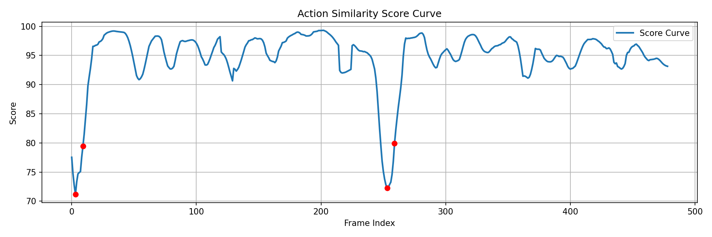

# AIDance —— 基于人体姿态的双视频动作对比与评估系统

一个基于 **人体姿态估计** 的双视频动作对比与评估系统：输入一段「标准示范动作」视频和一段「用户动作」视频，系统会定量评估两者的动作相似度，输出整体评分、评分变化曲线，并自动定位用户动作偏差最大的关键低分片段。

本项目将动作评估问题转化为「姿态结构相似性」问题，不依赖背景、服装或光照，适用于舞蹈、健身、康复训练等需要对动作进行客观评估的场景。

## 功能特性

- **双视频人工对齐**：通过滑块、方向键和帧号输入，精确对齐标准视频与用户视频的动作起始帧。
- **姿态提取**：使用 MediaPipe Pose 检测人体 33 个关键点，将像素空间转换为人体结构空间。
- **姿态归一化**：以髋关节为原点做平移不变，以躯干长度做尺度不变，消除身高、距离差异。
- **关键关节加权**：对手臂等关键部位赋予更高权重，使评分更关注动作主体。
- **帧级相似度计算**：对每一对同步帧计算加权余弦相似度，得到逐帧评分序列。
- **时间平滑**：滑动窗口平均，抑制单帧噪声，提升评分稳定性。
- **全局评分**：输出平均分与截尾均值（稳健指标）两种整体评价。
- **低分区间自动提取**：统计最低 5% 帧 + 时间非极大值抑制（Temporal NMS），合并相邻低分帧。
- **可视化与导出**：输出评分曲线图、关键低分帧图片以及可直接观看的低分动作片段 MP4。

## 系统流程

```
人工双视频对齐
      ↓
姿态提取（MediaPipe Pose）
      ↓
姿态归一化（平移 + 尺度）
      ↓
关键关节加权
      ↓
帧级加权余弦相似度
      ↓
时间平滑（滑动窗口平均）
      ↓
全局评分（均值 / 截尾均值）
      ↓
关键低分区间提取（5% 分位数 + 时间 NMS）
      ↓
可视化与结果输出（曲线图 / 关键帧 / MP4）
```

## 算法要点

| 模块 | 方法 | 说明 |
| --- | --- | --- |
| 姿态估计 | MediaPipe Pose | 深度学习姿态估计，检测 33 个关键点，每帧生成 66 维特征 |
| 几何归一化 | 平移 + 尺度归一 | 以左髋为原点、髋-肩距离为尺度基准 |
| 加权建模 | 关节加权 | 默认权重 1，手臂关节（11–16）权重 2.0 |
| 相似度度量 | 加权余弦相似度 | 衡量两个姿态向量方向的一致程度 |
| 时间平滑 | 滑动窗口平均 | 窗口大小 `SMOOTH_WIN = 10` |
| 低分筛选 | 分位数选择 | 取全程最低 5% 的帧 |
| 时间后处理 | Temporal NMS | 帧间隔 `MIN_GAP = 5`，合并相邻低分帧、保留局部低谷 |
| 稳健统计 | 截尾均值 | 剔除最低 10% 后取均值，降低异常值影响 |

## 目录结构

```
aidance/
├─ pose-compare.ipynb        # 主程序（7 个代码单元格，按顺序运行）
├─ 项目逻辑.docx              # 项目设计与算法说明文档
├─ requirements.txt          # Python 依赖
├─ README.md
├─ videos/                   # 标准视频与用户视频
├─ manual_align_results/     # 输出：评分 CSV、曲线图、关键帧、低分 MP4
├─ data/                     # （预留）数据目录
└─ models/                   # （预留）模型目录
```

## 快速开始

### 环境要求

- Python 3.12（已在 3.12.3 上验证）
- 本地图形界面环境（部分单元格使用 OpenCV GUI 窗口进行交互）

### 安装

```bash
# 克隆仓库
git clone <your-repo-url>
cd aidance

# 创建并激活虚拟环境
python -m venv .venv

# Windows
.venv\Scripts\activate

# 安装依赖
pip install -r requirements.txt

# 如需在本地以 Notebook 形式运行，再安装 Jupyter
pip install jupyter ipykernel
```

### 运行

```bash
jupyter notebook pose-compare.ipynb
```

按顺序运行各个单元格。其中「手动对齐」和「评分循环」两个单元格会打开 OpenCV 交互窗口，需要本地显示环境。

## 使用说明

Notebook 各步骤的功能如下：

1. **配置与环境**：设置标准视频、用户视频路径及参数。
2. **姿态工具函数**：定义特征提取、归一化、加权余弦相似度等函数。
3. **双视频手动对齐**：交互式选择标准视频和用户视频的起始帧。
4. **评分循环**：逐帧计算并平滑相似度，实时显示骨架与评分。
5. **评分与低分提取**：输出整体评分，取最低 5% 并做时间 NMS。
6. **评分曲线可视化**：展示评分随帧变化曲线并标注低谷。
7. **结果导出**：保存评分曲线 PNG 与多个低分片段 MP4。

手动对齐时的键盘控制：

| 按键 | 功能 |
| --- | --- |
| `TAB` | 切换当前控制的视频（标准 / 用户） |
| `I` | 进入帧号输入模式 |
| `←` / `→` | 当前视频 ±1 帧微调 |
| `Enter` | 确认当前选择 / 确认输入的帧号 |
| `Esc` | 退出 |

对齐窗口同时提供滑块（粗调，10 帧一格），支持左右视频并排实时预览。

## 参数配置

主要参数集中在 `pose-compare.ipynb` 的第一个单元格，可按下表调整：

| 参数 | 默认值 | 说明 |
| --- | --- | --- |
| `STD_VIDEO` | `videos/queen4.mp4` | 标准示范动作视频 |
| `USR_VIDEO` | `videos/queen2.mp4` | 用户动作视频 |
| `SMOOTH_WIN` | `10` | 评分平滑窗口大小 |
| `MAX_WIDTH` | `1200` | 显示窗口最大宽度 |
| `MIN_GAP` | `5` | 时间 NMS 的帧间隔阈值 |
| `CLIP_RADIUS` | `20` | 每个低谷前后导出的帧数 |
| `FPS` | `15` | 导出低分 MP4 的帧率 |

## 输出结果

运行完成后，结果保存到 `manual_align_results/`：

- `scores.csv`：逐帧平滑评分。
- `score_curve.png`：评分变化曲线，红色点标注关键低谷帧。
- `low_key*.jpg`：关键低分帧图片，文件名包含帧号与分数。
- `low_score_clip_*.mp4`：合并后的低分动作片段，带实时分数标注。

示例评分曲线：



## 依赖

见 [requirements.txt](requirements.txt)。核心依赖：

- `mediapipe`：人体姿态估计
- `opencv-contrib-python`：视频读写、GUI 与图像处理
- `numpy`：数值计算
- `scikit-learn`：余弦相似度
- `matplotlib`：可视化

## 注意事项与已知限制

- 标准视频与用户视频路径目前硬编码在第一个单元格，使用前需根据实际情况修改。
- 手动对齐和评分循环依赖 OpenCV 交互窗口，不适合无显示环境（如无头服务器）。
- 姿态检测失败的帧不会计入评分，因此结果中的帧索引与原始视频帧号可能存在偏移。
- `LOW_SCORE_TH`、`SAVE_LOW_MAX` 等常量在当前实现中未参与计算，可作为后续清理项。
